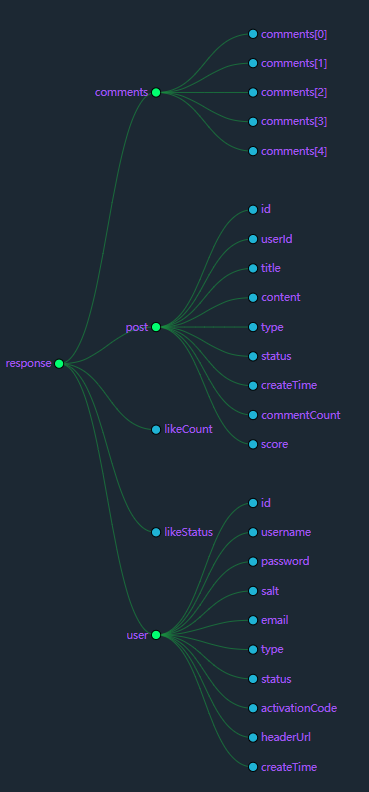
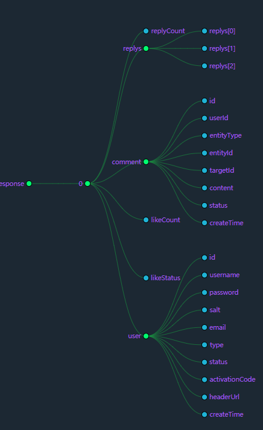

# 说明

接口文档总结

# 二蛋用到的接口整合

## 1.请求首页数据(get)

### url: 

/ & /index

### params：

```javascript
orderMode : { // 评论排序方式
	type: value
	defalut: 0
}
// 可选属性： 
// 0 - 最新
// 1 - 最热
page : { // 页码
    type: value,
    default : 1, 
}
```

## 2.登录功能(post)

### url:

/login

### data：

```javascript
{
 username: string, // 用户id
 password: string, // 用户密码
 code: string // 验证码
}
```

### return：

```javascript
{
  msg： string， // 返回值为当前用户的id
  code： value // 200:成功 2006:错误
}
```

## 3.获取个人主页信息(get)

### url:

/user/porfile/:userId

### return:

```
{
    "isHimself": true,
    "followeeCount": 0,
    "likeCount": 0,
    "hasFollowed": false,
    "user": {
        "id": 156,
        "username": "wcj",
        "password": "cb449e7fb4791f7d75a3fbeb9049dff5",
        "salt": "1464b",
        "email": "1097078562@qq.com",
        "type": 1,
        "status": 1,
        "activationCode": "1b289804caec444fb31f4b9b92ea4c3a",
        "headerUrl": "http://images.nowcoder.com/head/990t.png",
        "createTime": "2020-08-12T14:39:19.000+00:00"
	},
    "followerCount": 0
}
```

## 4.获取某评论相关信息（get）

### url：

/disscuss/detail/:dissId

### return:






## 5.添加评论功能(post)

### url:

/comment/add/:discussPostId

### data:

```json
{
	content: String,
    entityType: value, //1-文章 2-评论
    entityId: String,
    targetId: String,
}
```


# 添加评论功能(/comment/add/{discussPostId})

- 若添加成功，则跳转到：/discuss/detail/{discussPostId}，考虑放在msg中

```json
{
	"code": 200,
	"msg": "/discuss/detail/{discussPostId}"
}
```

- 添加失败：

```json
{
	"code": 2001,
	"msg": "添加评论失败，请重新尝试！"
}
```

### 统计数据接口(/data)
- 跳转到：site/admin/data页面

### 统计网站UV(/data/uv)
- 统计完成后请求：/data


### 统计活跃用户(/data/dau)
- 统计完成之后请求：/data

### 发布帖子(/discuss/add)

- 发布成功

```json
{
	"code": 200,
	"msg": "发布成功！"
}
```

- 发布失败

```json
{
	"code": 2002,
	"msg": "发布失败，请重新尝试！"
}
```

### 帖子详情(/discuss/detail/{discussPostId})
- 跳转到详情页面：site/discuss-detail


### 置顶帖子(/discuss/top)
- 置顶成功

```json
{
	"code": 200,
	"msg": "置顶成功！"
}
```

- 置顶失败：

```json
{
	"code": 2003,
	"msg": "置顶失败！"
}
```

### 加精帖子(/discuss/wonderful)
- 加精成功

```json
{
	"code": 200,
	"msg": "加精成功!"
}
```

- 加精失败

```json
{
	"code": 2004,
	"msg": "加精失败!"
}
```

### 删除帖子(/discuss/delete)
- 删除成功

```json
{
	"code": 200,
	"msg": "删除成功！"
}
```

- 删除失败

```json
{
	"code": 2005,
	"msg": "删除失败！"
}
```

### 关注功能(/follow)

```json
{
	"code": 200,
	"msg": "已关注！"
}
```

### 取关功能(/unfollow)

```json
{
	"code": 200,
	"msg": "已取消关注！"
}
```

### 查看某人关注的所有用户(/followees/{userId})
- 跳转到：site/followee

### 查看某个用户的所有粉丝(/followers/{userId})
- 跳转到：site/follower


### 


### 跳转到500("/error")
- error/500


### 点赞功能(/like)


### 跳转到注册页面(/register)
- site/register

### 跳转到登录页面(/login)
- site/login

### 注册账号接口(/register)

### 激活码接口(/activation/{userId}/{code})

### 验证码接口(/kaptcha)


### 登录接口(/login)


### 私信列表(/letter/list)

### 查询与某人的私信列表(/letter/detail/{conversationId})


### 发送私信(/letter/send)


### 系统通知(/notice/list)

### 通知详情(/notice/detail/{topic})


### 搜索(/search)

### 设置(/setting)
- 跳转到site/setting

### 上传(/upload)

### 获取个人头像(/header/{fileName})

### 获取个人主页(/profile/{userId})

### 修改密码(/password)

### 我的帖子(/myDiscussPost/{userId})

### 我的回复(/replyPost/{userId})

